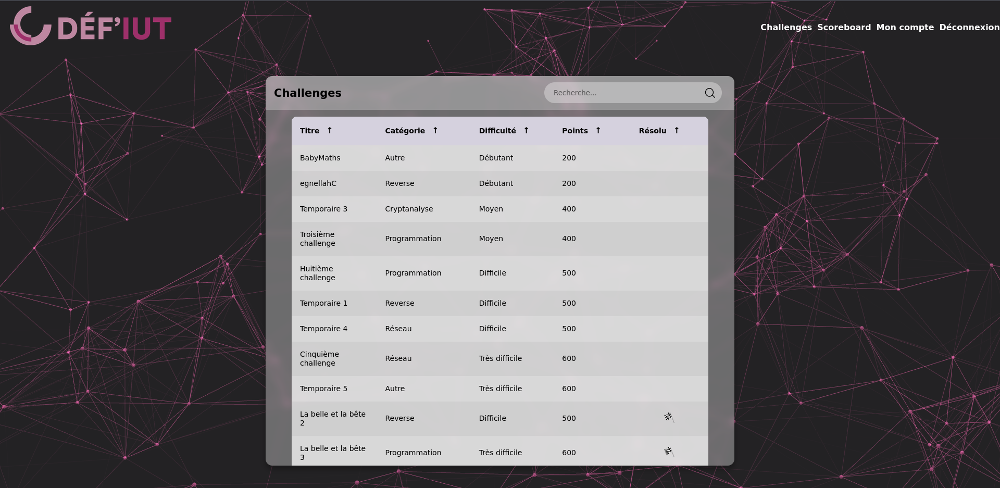
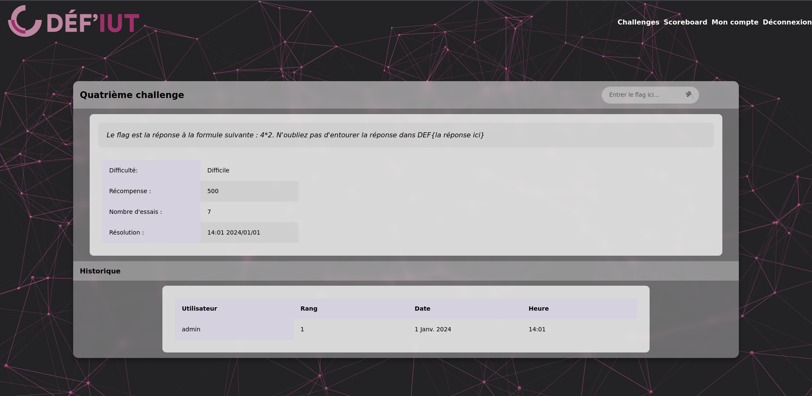
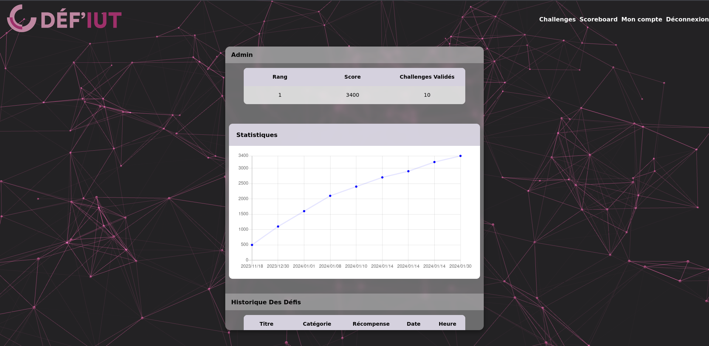
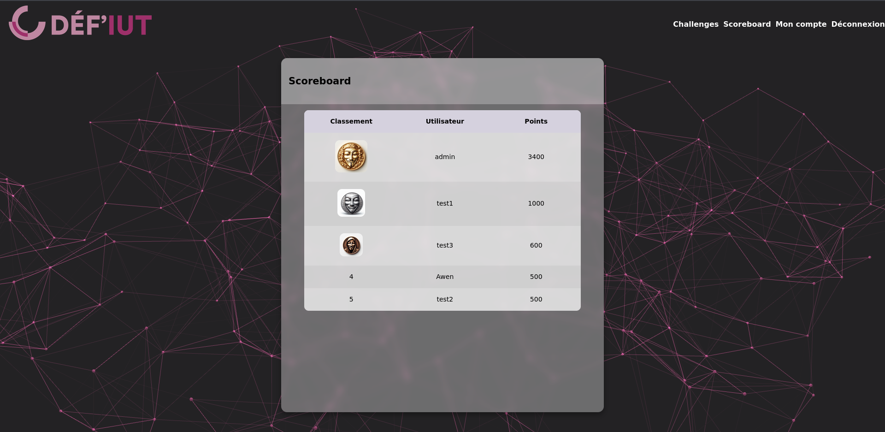

# Déf-IUT

Cette application a pour but d'héberger des challenges informatiques divers pour les étudiants de l'UBS  
Pour plus d'informations, reportez-vous au [cahier des charges](./documents/cahier_des_charges.pdf).

Le code source de cette application est disponible à l'adresse suivante : https://github.com/Ne0re0/Def-IUT/
## Aperçu

**Page d'accueil**


**Page de challenge**


**Profil public d'un utilisateur**


**Tableau des scores**



## Configuration

1. Installation des packages nécessaires au lancement de l'application

```bash
sudo apt install git npm sqlite3 docker-compose -y
```

2. Clonage du répertoire

```bash
git clone https://github.com/Ne0re0/Def-IUT.git
cd Def-IUT
```

3. Réinitialisation de la base de données

```bash
./reset-database
```

4. Installation des librairies `npm`

```bash
./install-libraries
```


5. Mise à jour des challenges dans l'application

**/!\\ N'exécutez cette commande que si vous souhaitez ajouter les challenges exemples**  

Si vous souhaitez ajouter vos propres challenges, veuillez d'abord remplacer les challenges présents dans `conf/challenges.yml` par les vôtres (cf [personnalisation des challenges](./conf/README.md))

```bash
./update-challenges
```

6. Configurer le serveur SMTP
Pour que l'envoi de courriels puisse être effectif, il convient de compléter cette configuration en suivant les étapes ci-dessous :
```bash
mv conf/mail.yml.template conf/mail.yml
```
Ouvrez `conf/mail.yml` avec l'éditeur de votre choix et compléter les informations suivantes :
- smtpServer
- login
- password
- smtpPort

Sauvegardez et quittez

**Pour la démonstration**
```bash
cat /mail.yml > /tmp/Def-IUT/conf/mail.yml
```

## Tests

Cette étape est uniquement utile dans un but de démonstration.  
Ne saississez pas cette commande en production
```bash
./insertions-test
```


## Installation locale 


1. Lancement de l'application

```bash
./start
```

2. L'application est lancée sur le port 3000 :  http://localhost:3000


## Installation avec Docker


1. Lancement de la conteneurisation

```bash
sudo docker-compose up --build -d # La première installation peut durer un certain moment en fonction de votre débit
```

2. L'application est lancée sur le port 3000 :  http://localhost:3000

## Accès distant

Pour accéder à l'intérieur du Docker, il suffit d'exécuter la commande suivante : 

```bash
sudo docker exec -it defiut /bin/bash
```

## Démarrage / Arrêt

```bash
# Depuis le répertoire Def-IUT/
sudo docker-compose up   # Démarrage
sudo docker-compose down # Arrêt
```

## Ajout/modification des challenges

Comme demandée dans le cahier des charges, la gestion des challenges se fait depuis un accès terminal ainsi qu'à un fichier de configuration `conf/challenges.yml`

```bash
sudo docker exec -it defiut /bin/bash
# Modification du fichier /app/conf/challenges.yml selon les règles de sa documentation (à l'intérieur du fichier)
./update-challenges
```

## Présentation de l'API

- `/` liste les challenges disponibles
- `/challenge/ID` affiche le challenge dont l'identifiant correspond à ID
- `/user/ID` affiche le profil public de l'utilisation dont l'identifiant correspond à l'ID
- `/myprofile` affiche le profil privé de l'utilisateur et lui permet de modifier et supprimer son compte
- `/scoreboard` affiche un tableau des scores
- `/recover` permet à l'utilisateur de s'envoyer un mail de récupération de mot de passe avec un jeton de réinitialisation
- `/recover/JETON` permet à l'utilisateur dont le jeton correspond à changer son mot de passe 
- `/verify/JETON` permet à l'utilisateur de vérifier son adresse e-mail, le jeton est récupéré via un mail

### Présentation de la base de données [ici](./src/database/README.md)
### Présentation de la gestion des challenges et des mails [ici](./conf/README.md)
### Présentation de la journalisation [ici](./log/README.md)

#### [Politique de confidentialité](./documents/confidentialité.pdf)
#### [Conditions générales d'utilisation](./documents/utilisation.pdf)
