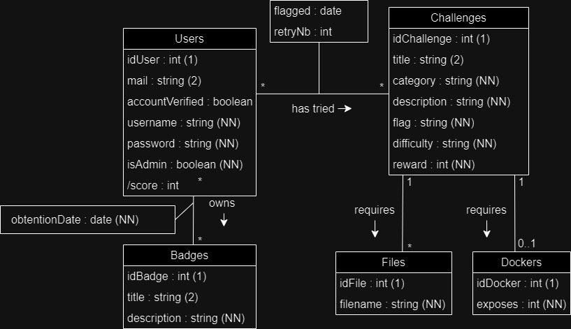

# Base de donnée



## Contraintes

##### Users

- **password** contains the clear password's bcrypt hash
- **mail** must match the following regex : `^[^@]+@.*univ-ubs\.fr$` (i.e. *@*univ-ubs.fr)

##### Challenges

- **reward** >= 0
- DOM(**category**) = ["Web","Cryptanalyse","Forensic","Reverse","Programmation","Réseau","Autre"]
- DOM(**difficulty**) = ["Débutant","Facile","Moyen","Difficile","Très difficile"]

##### Dockers

- **port** specifies the exposed port from the docker so, 0 < port <= 65 535

##### Others

- **flagged** is null if the challenge is not solved, otherwise contains the date of the resolution
- **retryNb** >= 0

## Schéma relationel

**Users** (idUser (1), mail (2), accountVerified, username (3), password (NN), isAdmin (NN))  
**Badges** (idBadge (1), title (2), description (NN))  
**Owns** (aUser=@Users.idUser (1), aBadge=Badges.idBadge(1),obtentionDate(NN))  
**Challenges** (idChallenge (1), title (2), category (NN), description (NN), flag (NN), difficulty (NN), reward (NN))  
**HasTried** (aUser=Users.idUser (1), aChallenge=Challenges.idChallenge (1), flagged, retryNb (NN))  
**Dockers** (idDocker (1), exposed(NN), itsChallenge=@Challenges.id(NN)(UQ))  
**Files** (idFile (1),  filename (NN), itsChallenge=@Challenges.id(NN))  

### Utilisation
Pour accéder à la base de données, il faut installer l'utilitaire sqlite3
```bash
sudo apt update
sudo apt install sqlite3
```

### Accès aux données
En ligne de commande : 
```bash
sqlite3 database.db 
# Des requêtes SQL vous seront nécessaires ici
```
Avec le navigateur
```bash
sqlitebrowser database.db 
```

### Initialisation / Réinitialisation
```bash
sqlite3 database.db < creation.sql 
sqlite3 database.db < insertion.sql 
```

